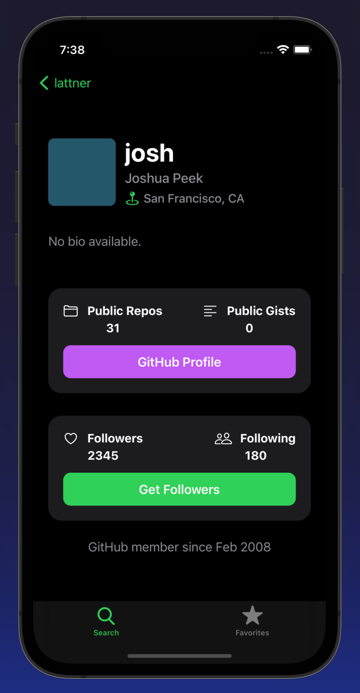

# GitHub Followers

An iOS application the allows you to search profiles on GitHub and view information about their followers. This includes:

- Basic profile information such as username, name, and bio
- \# of Public Repos
- \# of Public Gists
- \# of Followers
- \# of Following

Functionality also includes fetching a user's list of followers from their profile screen, viewing their GitHub.com profile in-app, and favoriting users for quicker access.

## Images

\**This project was part of an iOS course taught by https://seanallen.co/.*

